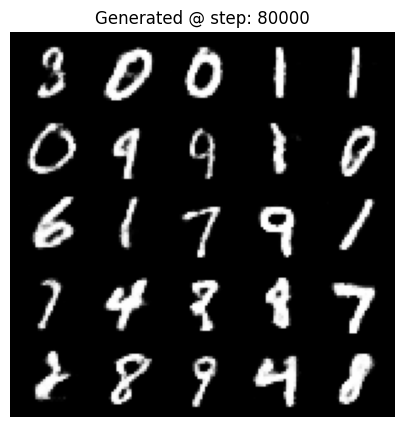

# Generating MNIST digits using GAN

This is a simple implementation of Generative Adversarial Networks (GAN) for generating MNIST digits.

I use simple BCE loss function for calculating the loss and Adam optimizer (lr=0.0001) for training.

read the notebook online:

## Architecture

- The **generator** is series of Linear layers with BatchNorm and ReLU activations.
- The **discriminator** is a series of Linear layers with BatchNorm andLeakyReLU activations.

## Training History

## Generation History

- Step 0

- step 1000

- step 3000

- step 18000

- step 80000
